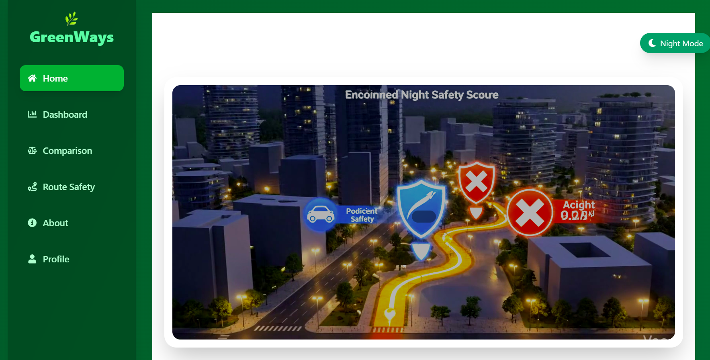
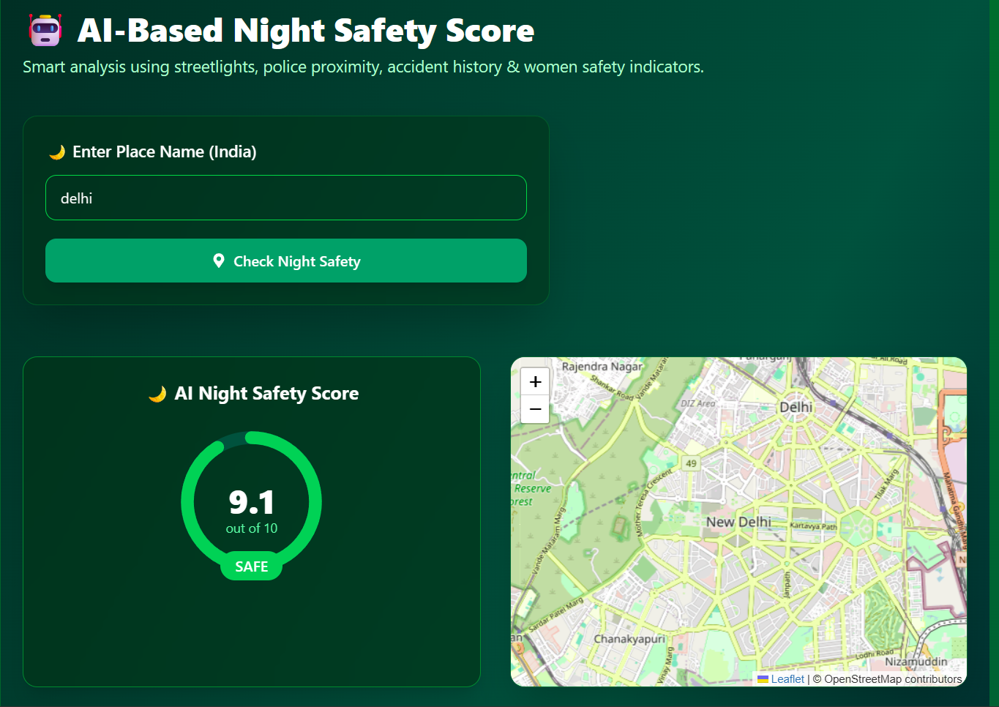

# 🌱 GreenPath – AI-Powered Sustainable Travel & Night Safety Platform

GreenPath is a cutting-edge, full-stack AI-driven web application designed to promote eco-friendly urban mobility while ensuring individual safety. The platform empowers users to make informed travel choices by comparing routes based on CO₂ emissions and evaluating night-time safety using sophisticated machine learning models.

---

## 🚀 Key Features

- **AI Night Safety Scoring**: Predictive model that calculates a "Safety Score" for any location based on streetlight density, police accessibility, and historical incident data.
- **Eco-Friendly Route Planning**: Compare multiple travel modes (Walking, Cycling, Public Transit, Driving) with real-time CO₂ emission analysis.
- **Smart City Integration**: Leverages real-world data to provide a holistic view of urban safety and sustainability.
- **Interactive UI**: A modern, responsive dashboard with dynamic maps (Leaflet/Mapbox) and data visualizations (Chart.js/Recharts).

---

## 🛠️ Technology Stack

### **Frontend**
- **React 19** & **Vite**
- **Tailwind CSS** (for sleek, premium UI)
- **Framer Motion** (for smooth animations)
- **React Leaflet / Mapbox GL** (for interactive mapping)
- **State Management**: React Hooks & Context API

### **Backend**
- **Node.js & Express**: Core API and user management.
- **Python & Flask**: Dedicated AI/ML service for safety score processing.
- **Database**: CSV-based historical data for safety analysis.

### **AI/Machine Learning**
- **Predictive Modeling**: Trained on accident history, streetlight density, and city safety datasets.
- **Safety Algorithm**: Evaluates multiple parameters to provide real-time safety insights.

---

## 📸 Screenshots

| Home Dashboard | AI Night Safety Score |
| :---: | :---: |
|  |  |

---

## ⚙️ Installation & Setup

1. **Clone the repository**:
   ```bash
   git clone https://github.com/RIYUSH1/greenpath.git
   cd greenpath
   ```

2. **Setup Frontend**:
   ```bash
   cd frontend
   npm install
   npm run dev
   ```

3. **Setup Node Backend**:
   ```bash
   cd ../backend
   npm install
   node server.js
   ```

4. **Setup Python AI Service**:
   ```bash
   cd ../python-backend
   pip install -r requirements.txt
   python app.py
   ```

---

## 🌍 Impact
GreenPath aims to reduce carbon footprints by encouraging sustainable transport alternatives while providing the necessary safety assurances for commuters, especially during night-time travel.

---

Developed with ❤️ as part of the **Advanced Urban Mobility Initiative**.
